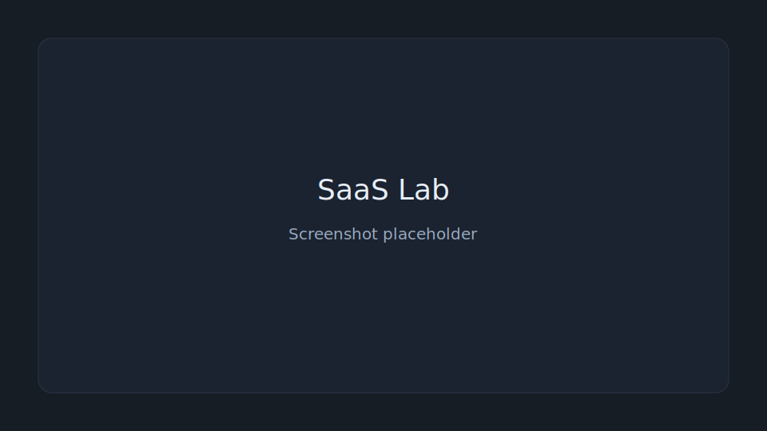

# SaaS Lab

**Problem:** Every new PHP SaaS experiment rebuilds the same authentication, database, and project scaffolding.

SaaS Lab is a lightweight PHP and SQLite workspace for rapidly building, testing, and validating SaaS ideas. It eliminates repetitive setup with shared authentication, project templates, automatic migrations, and isolated project databases, so new prototypes can launch in minutes.

**V1 scope:** Shared accounts, one project template launcher (`logged-in-prototype`), isolated project databases, standard activity events, and a minimal Founder Dashboard.



## Requirements

- PHP 8.2+
- PDO SQLite
- Apache with `mod_rewrite` (Hostinger shared hosting)
- Writable directories: `data/`, `storage/logs/`, `storage/uploads/`, `projects/`

No Node.js, Docker, Composer packages, or build step required.

## Installation (Hostinger)

1. Upload or sync this repository.
2. Point the domain document root to `public/`.
3. Copy `config.local.example.php` to `config.local.php`.
4. Set `base_url` to your production URL (subdirectory installs are supported; session cookie path is derived automatically).
5. Ensure `data/`, `storage/`, and `projects/` are writable (`chmod 775` via File Manager if needed).
6. Visit `/install` and create the first administrator.
7. Register a member, sign in as admin, and create your first project from `/founder`.

## Core loop

Install from migrations → create a shared user → create a project → open it with the shared account → complete the core action → see the Founder Dashboard update.

## Project development

Generated projects live under `projects/{slug}/` and are opened through `/p/{slug}/{page}`.

### Adding a page

Create `app/pages/my-page.php` and optionally `app/views/my-page.php`:

```php
<?php
declare(strict_types=1);
require dirname(__DIR__, 2) . '/bootstrap.php';
auth()->requireLogin();
project_view('my-page', [
    'project' => project(),
    'user' => auth()->user(),
]);
```

### Adding a migration

Add an ordered SQL file such as `app/migrations/002_create_challenges.sql`. Pending migrations run automatically during project bootstrap when the latest filename differs from the recorded migration key.

### Helpers

- `auth()` — shared authentication
- `project_db()` — parameterized project queries (`fetchAll`, `fetchOne`, `run`)
- `project()` / `current_project_slug()` — current project context
- `csrf_field()` / automatic POST CSRF verification
- `lab_event('event_name', [...])` — best-effort activity logging
- `e()` — HTML escaping

### Events

- `project_opened` — once per authenticated visit token per project
- Configured core action (template default: `item_created`) — counted on the Founder Dashboard

## Security

- Runtime files are gitignored (`*.sqlite`, WAL/journal sidecars, logs, uploads, `config.local.php`, `installed.lock`)
- Database files remain outside `/public`
- HTTPS is expected in production
- Passwords are hashed; CSRF protects state-changing requests; project slugs/pages are validated before filesystem resolution

## Local verification

```bash
php scripts/verify_phase1.php
php scripts/verify_phase2.php
php scripts/verify_acceptance.php
```

## Status

V1 Phases 1–7 are implemented. See `docs/V1_IMPLEMENTATION_PLAN.md` and `docs/PHASE_STATUS.md`.

V1 focuses on project launching and basic usage measurement; broader validation and portfolio-management tools may come later.
